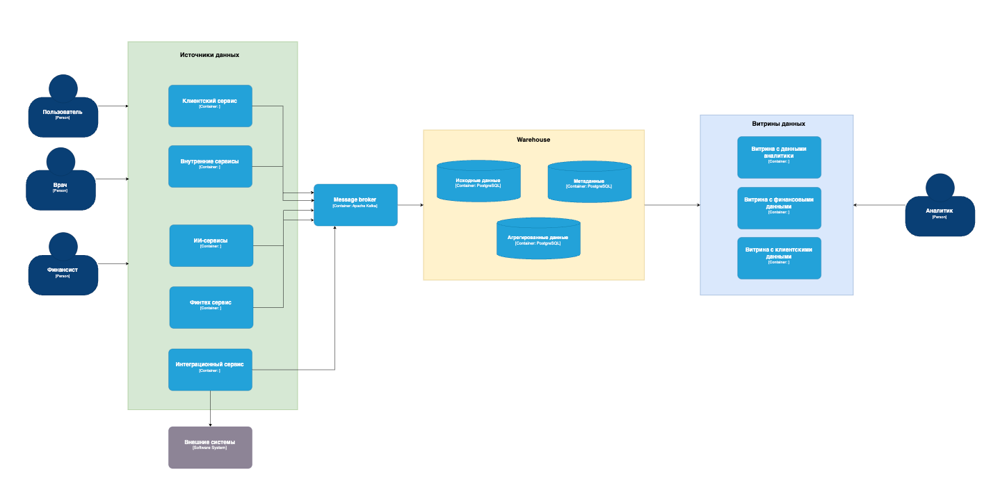

# Архитектура системы для обработки больших данных    

## Проблемные места:    
- сложно создавать отчетность из-за больших данных;
- невозможно создавать отчетность самостоятельно; 
- устаревший MSSQL Server 2008;   
- сложно интегрировать новые и внешние системы с PowerBuilder;    
- неудобный интерфейс, требуется витрина данных;      
- проблема с масштабированием;    

## Приоритизация решения проблем в архитектуре методом Moscow:

### Must (обязательно)      
- решить проблему обработки больших данных и скорости создания отчетов;     
- разработать интерфейс с витринами данных; 
### Should (нужно)          
- решить проблему интеграции новых и внешних сервисов;   
### Could (желательно)
- решить проблему создания отчетов самостоятельно;    
### Won’t Have this time (можно перенести)
- решить проблему масштабирования;

## Архитектура обработки данных
