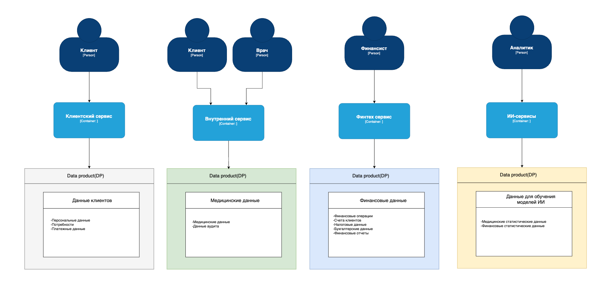

# Домены системы    

В системе можно выделить следующие домены:      
1. Домен, формирующий поток медицинских данных;     
2. Домен, формирующий поток клиентских данных;   
3. Домен, формирующий поток финансовых данных;    
4. Домен, формирующий поток с данными для ии;  

Каждый домен формирует свой "продуктовые данные":     

### Data Flow Diagram            

