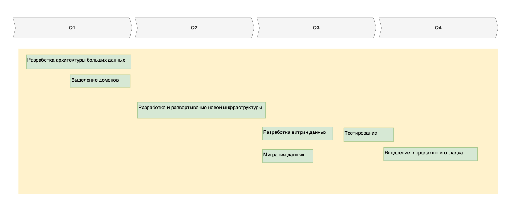

# Технический радар 

| **Квадранты**                       | **Кольца** | **Тренды движения** |
|:------------------------------------|------------|---------------------|
| ИИ-сервисы Python                   | Adopt      | New                 |
| Финтех сервисы Java, Golang         | Adopt      | New                 |
| Внутренние сервисы Java, Golang     | Adopt      | New                 |
| Интеграционные сервисы Java, Golang | Adopt      | New                 |
| Warehouse PostgreSQL                | Adopt      | New                 |
| Витрины данных React.js             | Adopt      | New                 |
| Message Broker (Apache Camel)       | Adopt      | No change           |
| DWH                                 | Hold       | No change           |
| MS SQL Server 2008                  | Hold       | No change           |
| PowerBI                             | Hold       | No change           |

**Adopt** — устоявшиеся технологии. Они используются в проде, имеют низкий уровень риска и рекомендуются к широкому применению.     
**Trial** — «пробные» технологии или «технологии на подъёме», которые успешно работают и проверены на реальной проблеме, 
но у которых, возможно, выявлены ещё не все ограничения. У таких технологий степень риска пока выше в силу небольшого применения.       
**Asset** — «оценочные» технологии, которые являются многообещающими и имеют явную потенциальную ценность для организации — 
те самые инвестиции. Они подходят для создания прототипов в целях выявления ограничений и возможностей.     
**Hold** — по факту технологии, которые больше нежелательны для применения в новых проектах. Они с большой вероятностью 
будут постепенно выводиться из ландшафта.

## Q1   
- Разработка архитектуры больших данных;    
- Выделение доменов;    
**Результат:** подготовленная техническая документации и выбранные технологии;    

## Q2   
- Разработка и развертывание новой инфраструктуры;    
**Результат:** подготовлена новая инфраструктура для дальнейшей работы с большими данными;    

## Q3   
- Разработка витрин данных;   
- Миграция данных;   
- Тестирование;   
**Результат:** внедрены инструменты для составления отчетов в витринах данных;    

## Q4   
- Тестирование;   
- Внедрение в продакшн и отладка;   
**Результат:** новая система введена в эксплуатацию;

## Roadmap
